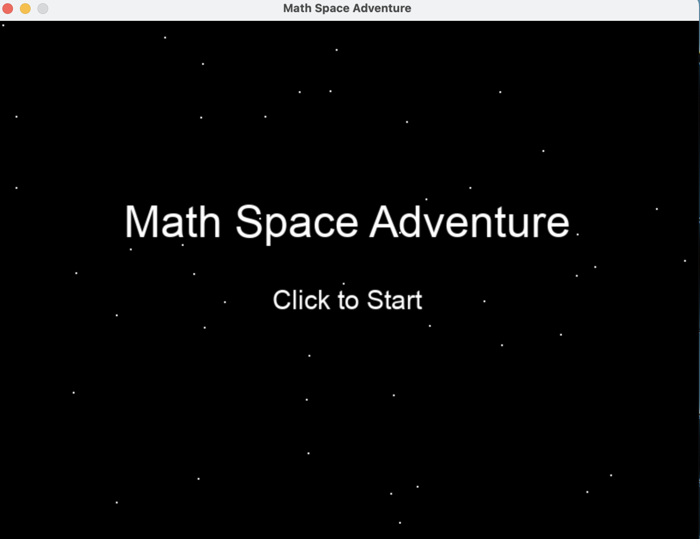
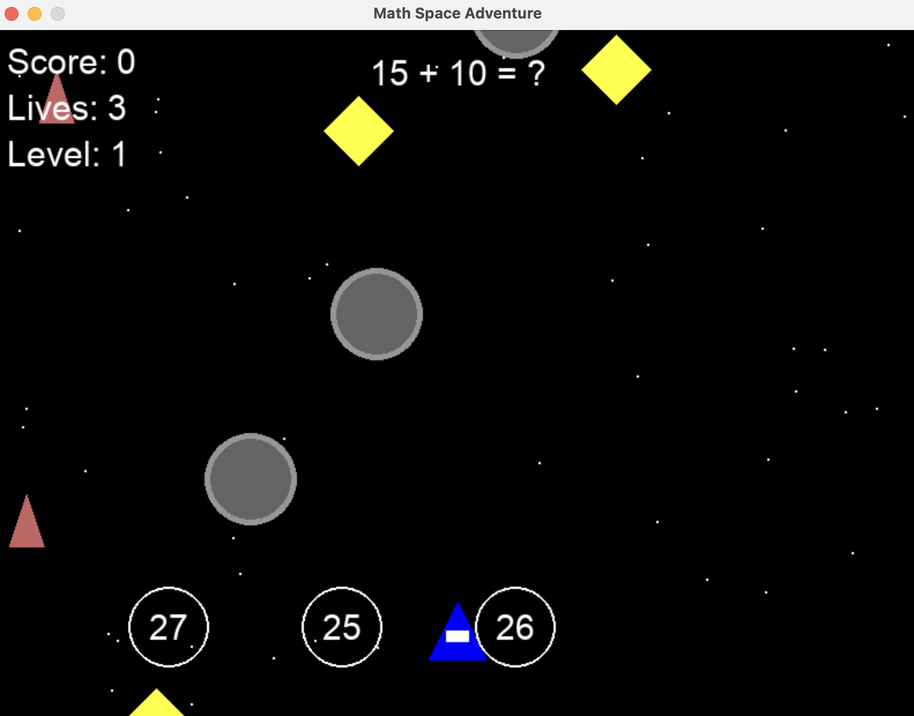
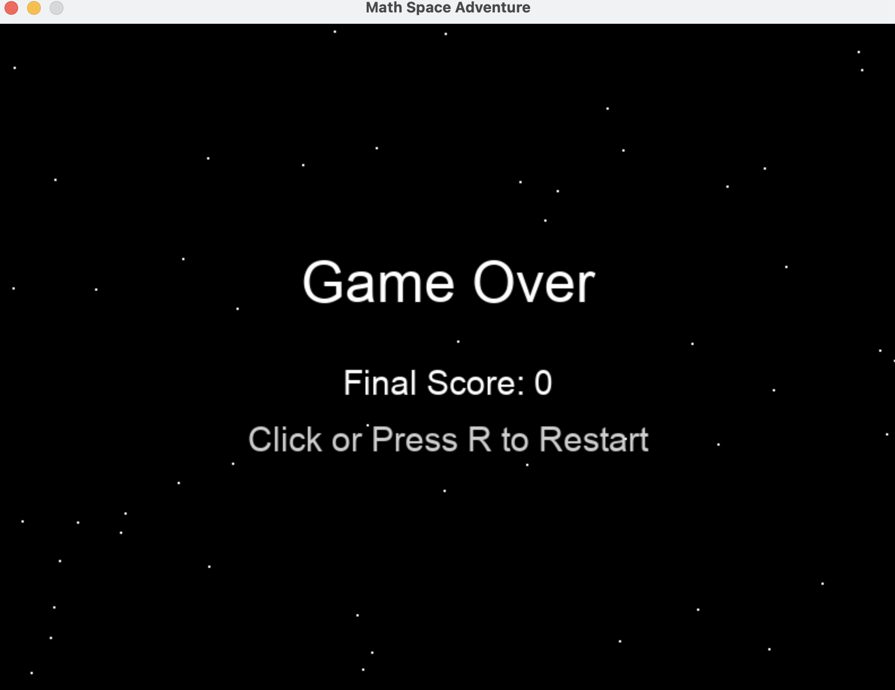

# Math Space Adventure 🚀

**Math Space Adventure** is an educational game developed to make learning mathematics fun and engaging. Players control a spaceship to collect correct answers to math problems while dodging meteors and collecting bonus stars. With 9 levels of increasing difficulty, the game challenges players with progressively harder math questions and faster-paced gameplay.

---

## ✨ Features

- 📚 **9 levels** of math problems, from basic addition to factorials and logarithms  
- 🎮 **Intuitive controls**: use Left and Right arrow keys to move the spaceship  
- 🪐 **Space-themed interface** with starry background and particle effects  
- 📊 **Player stats**: track score, lives, and level progress  
- 🔊 **Sound effects** for correct/wrong answers and bonuses (generated using NumPy)  
- 🔄 **Animated Game Over screen** with restart via mouse click or `R` key  
- ⚡ **Progressive difficulty**: faster enemies and more complex questions as you level up  

---

## 🖼️ Screenshots & Descriptions

### 🔹 `main_menu.png` – Main Menu  
Shows the game’s title and a "Click to Start" prompt on a starry space background.  


---

### 🔹 `game_screen.png` – Game Screen  
Displays the spaceship, current math question, falling answer circles, meteors, score, level, and remaining lives.  


---

### 🔹 `game_over.png` – Game Over Screen  
Shows a "Game Over" message with the final score and an animated prompt to "Click or Press R to Restart".  


---

## 📈 Difficulty Progression

The game becomes more challenging with each level:

- 🧠 **Math Complexity**: Starts with simple addition and advances to square roots, equations, logarithms, and factorials.  
- 🚀 **Enemy Speed**: Meteors and fast meteors move quicker as levels progress.  
- 🌑 **Enemy Frequency**: More meteors appear on higher levels, increasing the difficulty.  
- 🕹️ **Answer Speed**: Correct and incorrect answers fall faster, requiring quicker decisions.  

---

## 🧮 Levels Breakdown

| Level | Topic                  | Example                     |
|-------|------------------------|-----------------------------|
| 1     | Addition               | `5 + 3 = ?`                 |
| 2     | Subtraction            | `25 - 12 = ?`               |
| 3     | Multiplication         | `7 * 4 = ?`                 |
| 4     | Division               | `20 / 5 = ?`                |
| 5     | Exponents              | `2^2 = ?`                   |
| 6     | Square Roots           | `sqrt(16) = ?`              |
| 7     | Simple Equations       | `3*x = 12, x = ?`           |
| 8     | Logarithms             | `log2(8) = ?`               |
| 9     | Factorials             | `5! = ?`                    |

---

## 🎮 How to Play

1. **Run the game:**
   ```bash
   python advanced_math_game.py
